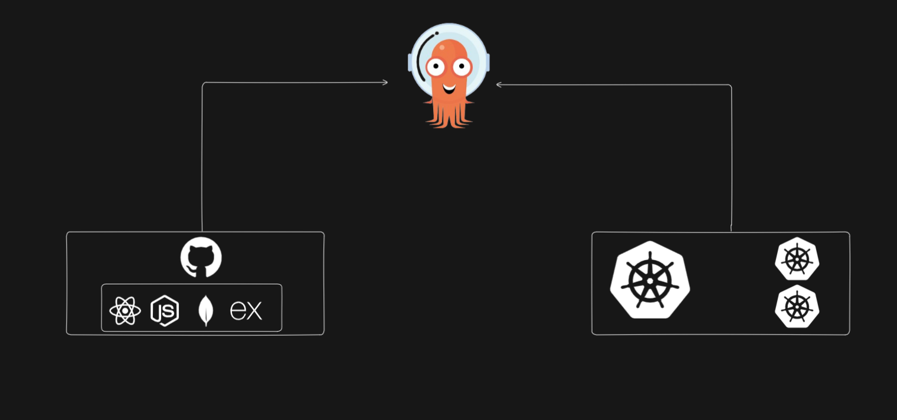

# MERN App Deployment on Kubernetes Using GitOps with ArgoCD

## Architecture Diagram

This project demonstrates the deployment of a **MERN (MongoDB, Express.js, React.js, Node.js)** application on a Kubernetes cluster using GitOps principles with **ArgoCD**. It focuses on automating deployment, scaling, and management of a cloud-native application while leveraging the power of Kubernetes and GitOps.

## Overview

GitOps is a modern way of managing infrastructure and applications declaratively using Git as the single source of truth. With ArgoCD, changes pushed to the Git repository automatically synchronize with the Kubernetes cluster, ensuring a consistent and reliable deployment process.

---

## Features

- **MERN App on Kubernetes:** Containerized MERN application running on Kubernetes clusters.
- **GitOps with ArgoCD:** Automates deployment, rollback, and monitoring.
- **Scalability:** Kubernetes ensures horizontal scalability for high-availability applications.
- **Declarative Configuration:** Kubernetes manifests and Helm charts are version-controlled.
- **CI/CD Integration:** Continuous deployment pipelines ensure faster delivery.

---

## How to Star the Repository
If you find this project helpful, please star the repository on GitHub to show your support:
1. Click the ⭐ button in the top-right corner.

---

## Author
**Jibran**  
Passionate DevOps Engineer and Software Developer.
Connect with me on [LinkedIn](https://www.linkedin.com/in/muhammad-jibran220/).

---
 

## Feedback & Contributions
Contributions are welcome! Feel free to fork the repository and submit a pull request.

---

 